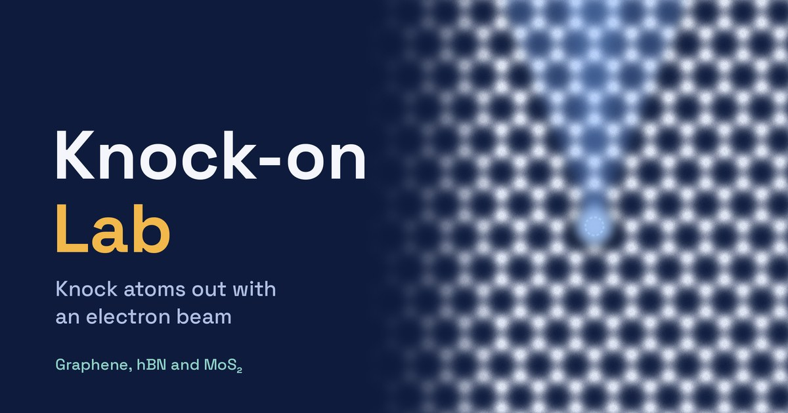

# Knock-on Lab

An educational browser game about electron-beam knock-on damage in scanning transmission electron microscopy (STEM). Pick a 2D crystal (graphene, hBN or MoS₂), set up the microscope and find out when the beam knocks an atom out of the lattice.

Available in English, Spanish and Portuguese.

**Play:** https://knockonlab.netlify.app



## For teachers
Runs in any modern browser, on desktop or mobile, with no installation or sign-up.

## Run locally
Open `index.html` in a browser, or serve the folder with
```
python -m http.server 8000
```
and go to http://localhost:8000.

## Author
Luis E. Piedra, International Iberian Nanotechnology Laboratory (INL), Braga, Portugal.

## How to cite
See `CITATION.cff` (or GitHub's *Cite this repository* button).

## License
MIT, see `LICENSE`.
